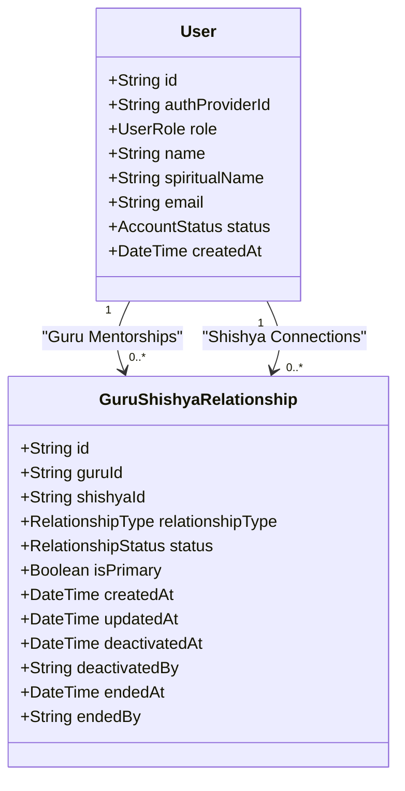
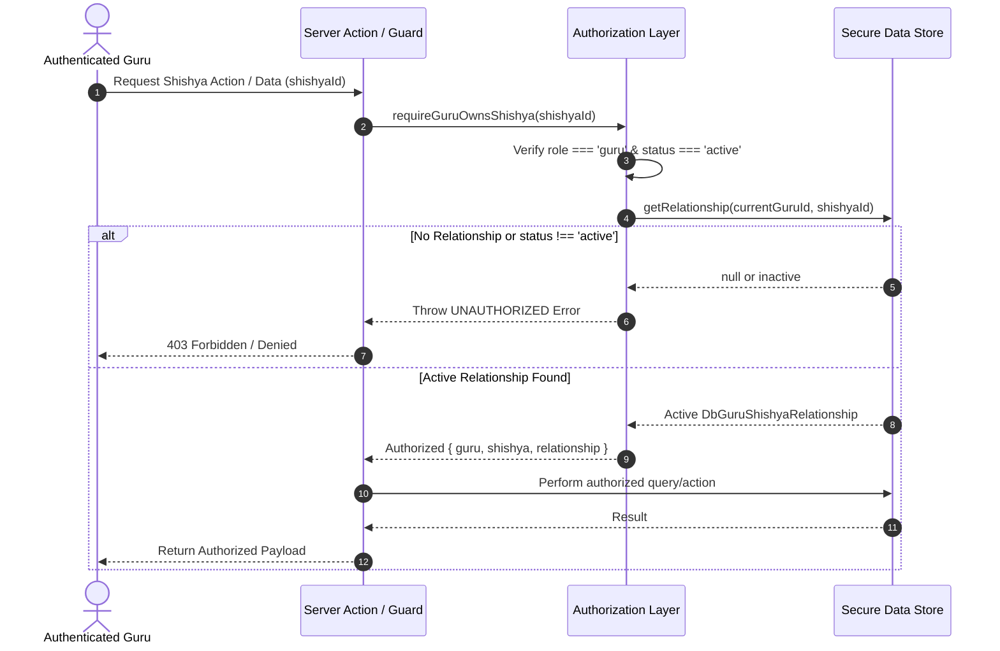
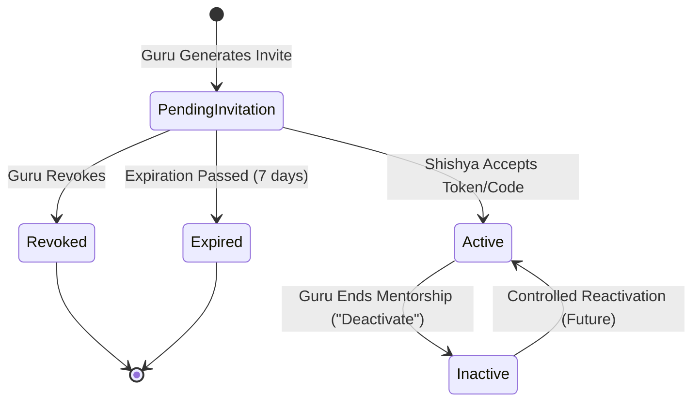

# Guru–Shishya Relationship & Authorization Architecture

**Platform**: Nityasādhanā  
**Phase**: 6 (Milestone 30–34%)  
**Status**: Authoritative Reference  

---

## 1. Executive Summary & Relationship Model

The Guru–Shishya relationship is the foundation of Nityasādhanā's authorization boundary. Almost every downstream domain—including daily Sādhanā logging, chanting/japa, hearing, reading, spiritual reflection, time auditing, mentor observations, and analytics—is authorized based on this relationship.

### Entity Model

Rather than coupling the Guru ID directly to the `User` record (which would prevent future multi-mentorship), the relationship is modeled as a first-class entity:



### Model Schema Definition

```typescript
export type RelationshipStatus = "active" | "inactive" | "ended";

export type RelationshipType = "primary_guru"; // Future: "mentor" | "co_mentor" | "counselor"

export interface DbGuruShishyaRelationship {
  id: string;
  guruId: string;
  shishyaId: string;
  relationshipType: RelationshipType;
  status: RelationshipStatus;
  isPrimary: boolean;
  createdAt: string; // ISO UTC
  updatedAt: string; // ISO UTC
  deactivatedAt?: string; // ISO UTC
  deactivatedBy?: string; // userId who ended the relationship
  endedAt?: string; // ISO UTC
  endedBy?: string; // userId
}
```

---

## 2. V1 Business Rules

1. **One Primary Guru per Shishya**:
   - In V1, each Shishya may only have **one** active primary Guru (`relationshipType = "primary_guru"`, `isPrimary = true`, `status = "active"`).
2. **One Guru to Many Shishyas**:
   - A single Guru can guide multiple Shishyas.
3. **No Independent Shishya Attachment**:
   - A Shishya cannot independently select, attach to, or alter their Guru.
   - Relationship creation is cryptographically bounded to the **Guru Invitation Acceptance Flow** (Phase 5).
4. **No Public Relationship Creation Endpoints**:
   - Endpoints like `POST /api/relationships` with arbitrary `guruId` / `shishyaId` bodies are strictly prohibited.
5. **Fail-Closed Authorization**:
   - Unauthenticated or unauthorized requests fail closed. Private devotee data is never leaked.

---

## 3. Server-Authoritative Authorization Architecture

Authorization is enforced server-side. The server never trusts client-supplied identifiers (`guruId`, `shishyaId`, or `role`) from headers, cookies, URLs, or request bodies.

### Centralized Authorization Helpers (`lib/auth/authorization.ts`)

| Helper Function | Security Enforcement | Return Value |
| :--- | :--- | :--- |
| `requireAuthenticatedUser()` | Enforces valid Clerk session and `status === 'active'`. | `AuthenticatedUser` |
| `requireGuruUser()` | Enforces role `guru` from publicMetadata and `status === 'active'`. | `AuthenticatedUser` |
| `requireShishyaUser()` | Enforces role `shishya` and `status === 'active'`. | `AuthenticatedUser` |
| `requireGuruOwnsShishya(shishyaId)` | Verifies authenticated Guru holds an **active** relationship with `shishyaId`. | `{ guru, shishya, relationship }` |
| `requireCurrentShishya(targetId?)` | Verifies user is a Shishya and matches target ID (prevents Shishya-to-Shishya access). | `{ shishya }` |

### Guru Authorization Flow



---

## 4. Relationship Lifecycle



### Status Meanings

- **Active**:
  - The relationship is valid.
  - The Guru can access the Shishya's authorized Sādhanā data and reports.
  - The Shishya can view their connected Guru.
- **Inactive**:
  - The relationship is historically preserved but no longer active.
  - The Guru **cannot** access private devotee Sādhanā records.
  - Shishya account, past Sādhanā logs, and audit trails remain intact.
- **Ended**:
  - Formal conclusion of mentorship lifecycle with immutable timestamps.

---

## 5. Deactivation ("End Mentorship") & Data Retention

Deactivation is designed with respect for spiritual relationships and strict data privacy.

### Terminology
- Use **"End Mentorship"** or **"Deactivate Connection"**.
- Never present this as "Delete Shishya" or "Delete Account".

### Inviolable Retention Principles
1. Ending mentorship **never deletes the Shishya's user account**.
2. Ending mentorship **never deletes historical Sādhanā logs or reports**.
3. The relationship record remains in the database with:
   - `status = "inactive"`
   - `deactivatedAt = ISO UTC timestamp`
   - `deactivatedBy = Guru User ID`

### Reinvitation Policy
- In V1, if a deactivated Shishya receives a new invitation, silent automatic reconnection is prevented:
  > *"This Shishya has previously been connected to a Guru. A new connection requires the appropriate reactivation process."*

---

## 6. Privacy Model & Zero ID Leakage

- **No Internal Database IDs in UI**: The client displays devotee spiritual names, names, connection statuses, and dates. Internal database UUIDs and hashes are kept server-side.
- **Minimum Privilege Data Retrieval**:
  - Guru queries only fetch active Shishyas connected to that specific Guru.
  - Shishya queries only fetch the Shishya's own active Guru.
- **Dynamic Caching Protection**: Next.js route caches are explicitly scoped or revalidated dynamically (`revalidatePath`). Private devotee records are never stored in shared/public HTTP caches.

---

## 7. Cross-Tenant Protection Matrix

### Cross-Guru Isolation
- **Guru A** has Shishyas `[A1, A2]`.
- **Guru B** has Shishyas `[B1]`.
- If **Guru A** requests data for **B1**, the authorization layer (`requireGuruOwnsShishya`) verifies ownership against the database, detects no active relationship between Guru A and B1, and **immediately denies access**.

### Cross-Shishya Isolation
- **Shishya A** cannot view **Shishya B's** Sādhanā logs, progress, or profile.
- Scoped endpoints like `requireCurrentShishya()` verify that the session user matches the requested data owner.

---

## 8. Database Constraints & Indexes

1. **Unique Active Primary Relationship**:
   - `UNIQUE(shishyaId)` WHERE `isPrimary = true` AND `status = 'active'`.
   - Prevents race conditions and duplicate primary Gurus.
2. **Lookup Indexes**:
   - `(guruId, status)`: O(1) retrieval of a Guru's active Shishya roster.
   - `(shishyaId, status, isPrimary)`: O(1) retrieval of a Shishya's active primary Guru.
   - `(guruId, shishyaId)`: O(1) authorization verification.

---

## 9. Future Multi-Mentor Architecture

Although V1 enforces one primary Guru per Shishya, the architecture supports future multi-mentorship without any database redesign:

```typescript
// Future Multi-Mentor Example (Supported natively by schema)
const primaryRelationship: DbGuruShishyaRelationship = {
  id: "rel_001",
  guruId: "guru_radheshyam",
  shishyaId: "shishya_arjun",
  relationshipType: "primary_guru",
  isPrimary: true,
  status: "active",
};

const mentorRelationship: DbGuruShishyaRelationship = {
  id: "rel_002",
  guruId: "mentor_chaitanya",
  shishyaId: "shishya_arjun",
  relationshipType: "mentor", // Future expansion
  isPrimary: false,
  status: "active",
};
```

Future Sādhanā reporting authorization will evaluate relationship type and permissions without rewriting the core `User` model.
